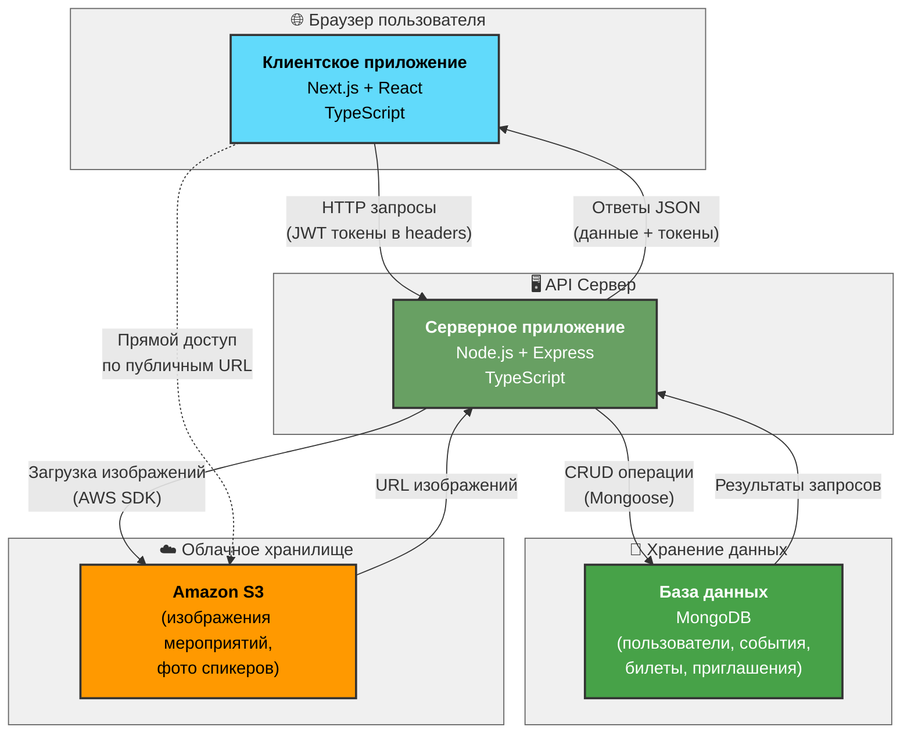

# Архитектура системы управления мероприятиями

## Диаграмма компонентов

## Описание взаимодействия компонентов

### 1. Клиентское приложение → API Сервер
- **Технология**: HTTP/HTTPS запросы
- **Аутентификация**: JWT токены в заголовках Authorization
- **Формат данных**: JSON

### 2. API Сервер → База данных
- **Технология**: MongoDB драйвер (Mongoose ODM)
- **Операции**: CRUD (Create, Read, Update, Delete)
- **Данные**: Пользователи, события, билеты, приглашения, спикеры

### 3. API Сервер → Amazon S3
- **Технология**: AWS SDK
- **Операции**: Загрузка и получение изображений
- **Данные**: Изображения мероприятий, фотографии спикеров

### 4. Клиентское приложение → Amazon S3
- **Технология**: Прямые HTTP запросы по публичным URL
- **Операции**: Получение изображений для отображения
