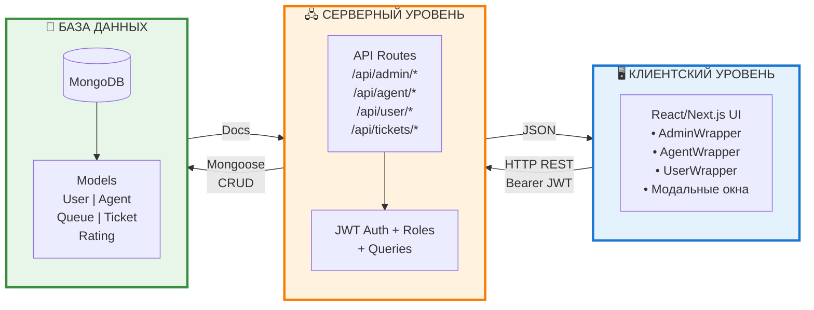

```mermaid
graph LR
    subgraph Client["🖥️ КЛИЕНТСКИЙ УРОВЕНЬ"]
        UI["React/Next.js UI<br/>• AdminWrapper<br/>• AgentWrapper<br/>• UserWrapper<br/>• Модальные окна"]
    end

    subgraph Server["🖧 СЕРВЕРНЫЙ УРОВЕНЬ"]
        API["API Routes<br/>/api/admin/*<br/>/api/agent/*<br/>/api/user/*<br/>/api/tickets/*"]
        Logic["JWT Auth + Roles<br/>+ Queries"]
        API --> Logic
    end

    subgraph Database["💾 БАЗА ДАННЫХ"]
        DB[("MongoDB")]
        Models["Models<br/>User | Agent<br/>Queue | Ticket<br/>Rating"]
        DB --> Models
    end

    Client -->|"HTTP REST<br/>Bearer JWT"| Server
    Server -->|"JSON"| Client
    Server -->|"Mongoose<br/>CRUD"| Database
    Database -->|"Docs"| Server

    classDef clientStyle fill:#e3f2fd,stroke:#1976d2,stroke-width:3px
    classDef serverStyle fill:#fff3e0,stroke:#f57c00,stroke-width:3px
    classDef dbStyle fill:#e8f5e9,stroke:#388e3c,stroke-width:3px
    
    class Client clientStyle
    class Server serverStyle
    class Database dbStyle
```
